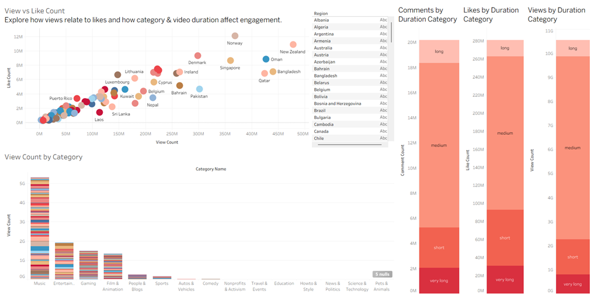

# YouTube-Global-Trends
End-to-end data project that collects YouTube trending videos worldwide using the YouTube Data API v3, processes them with Python, and visualizes insights in Tableau.

## Project overview
This repository fetches trending videos from YouTube Top Charts across regions, cleans and enriches the data, and prepares a dataset for exploratory analysis and Tableau dashboards.

**Key goals**
- Retrieve trending videos for many regions using the YouTube Data API v3.
- Clean, standardize, and enrich the data (e.g., duration buckets, continent).
- Produce a processed CSV ready for analysis and Tableau visualizations.
- Answer example questions:
  - Which categories dominate YouTube globally?
  - How do video durations vary across regions?
  - Which regions show distinct viewing patterns?
  - Is there a pattern between view count and like count?

## Tech stack
- **YouTube Data API v3** — video metadata  
- **Python** (Pandas, NumPy) — data collection & preprocessing  
- **Tableau** — dashboarding & visualization

### Repository Structure
```
├── youtube_trending_collector.py # API integration & data retrieval, Cleaning & transformations
├── data/
│   ├── raw_data.csv            # API results
│   ├── processed/              # Clean dataset for Tableau
├── tableau/
│   ├── dashboard.twbx          # Tableau workbook
├── visuals/
│   ├── sample_dashboard.png    # Preview of Tableau insights
└── README.md
```

### Understand the Dataset
- `region` — ISO code or region name  
- `title` — video title  
- `channelTitle` — channel name  
- `publishedAt` — publication timestamp
- `viewCount` — View Count 
- `likeCount` — Like Count
- `commentCount` — Comment Count  
- `duration` — Duration (hh:mm:ss) 
- `description` — Video Description Text  
- `categoryName` — Category (e.g., Music, Gaming,...)  
- `continent` — Continent derived from Region
- `duration_category` — `short` / `medium` / `long` Duration Category: derived from duration 
### Tableau Dashboard Preview
Click the images to open the interactive dashboard on Tableau Public.
This collection shows YouTube activity across countries. Click or hover to filter and drill down.

### Dashboard 1 — **Global YouTube: Top Category by Country**
[]([https://public.tableau.com/views/YourWorkbook/SheetNam](https://public.tableau.com/views/01-global-top-categories/GeographicalAnalysis?:language=de-DE&:sid=&:redirect=auth&:display_count=n&:origin=viz_share_link))
- **What it shows:** A world map with each analyzed country marked and labelled with its top YouTube category.  
- **Interaction:** Click a country on the map to update the pie chart on the right showing that country’s category distribution.  
- **Look for:** Which categories dominate by country and how category mixes differ regionally.

### Dashboard 2 — **Views vs Likes — Category & Duration Breakdown**
[](https://public.tableau.com/views/02-views-likes-duration/DataAnalysis?:language=de-DE&:sid=&:redirect=auth&:display_count=n&:origin=viz_share_link)
- **What it shows:**  
  - Top-left: Scatter plot of **views vs likes**.  
  - Bottom-left: **View count by category**.  
  - Right: three charts summarizing engagement by video length.  
- **Duration chart titles:**  
  - `Views by video length`  
  - `Likes by video length`  
  - `Comments by video length`  
- **Interaction:** Select points/countries on the scatter to filter the category and duration charts.  
- **Look for:** Relationship of likes to views, which categories get most views, and how engagement changes with video length.

### Dashboard 3 — **Top Channels by Country & Region**
[]([https://public.tableau.com/views/YourWorkbook/SheetName3](https://public.tableau.com/views/03-top-channels-by-region/MostPopularChannels?:language=de-DE&:sid=&:redirect=auth&:display_count=n&:origin=viz_share_link))
- **What it shows:** Bar chart of channels that were most popular per country; bars are colored by continent and heights show how many countries ranked that channel highly.  
- **Interaction:** Hover to see counts and contributing countries; use filters to focus by continent or country.  
- **Look for:** Channels with global vs regional popularity.


#### Future Improvements
- Automate daily API collection with cron jobs or Airflow.
- Add sentiment analysis of video comments.
- Predict video virality using machine learning.
